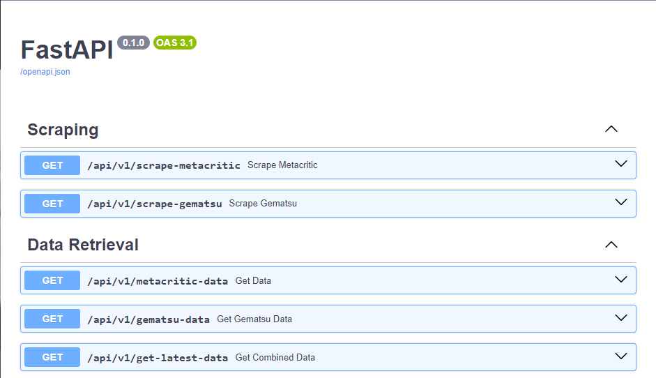

# Games Analyst

This project is a fully dockerized microservice which scrapes / aggregates games industry related information.

The 2 main sources at the moment are

1. Metacritic - for score / evalation related information.
2. Gematsu - for sales releated information. 

## API
The project uses a FastAPI REST API to execute batches / extract data. 

The project has the following REST endpoints. Currently there are 2 for scraping data sources and 3 for data retreival related.



## Database

Data is stored within a Mongo DB and configured within the .env file

## Configuration

in the .env file the following configuration exists

MONGODB_DB_USERNAME=          # DB username
MONGODB_DB_PASSWORD=          # DB password
MONGODB_DB_HOST=              # DB host. When running in docker use "mongoservice" as defined in the docker-compose.yml. When running locally use "localhost"
MONGODB_DB_PORT=              # INTERNAL Mongo DB port
MONGODB_DB_NAME=gamesanalyst  # default DB Name. "gamesanalyst" is a good default.

RESTAPI_PUBLISHED_PORT=       # the outward facing REST API port.
MONGODB_DB_PUBLISHED_PORT=    # the outward facing Mongo DB port.

## How to Run

This is a fully dockerized app so simply run the following command.

```
docker-compose up --build
```

## TODO

1. Add more analytics retreiving end points
2. Add a cron job to run scheduled scraping jobs 